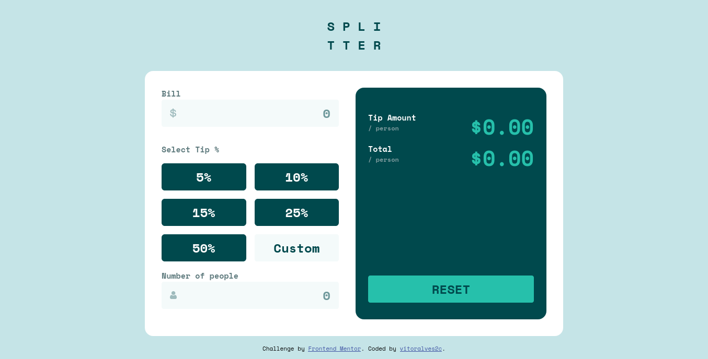
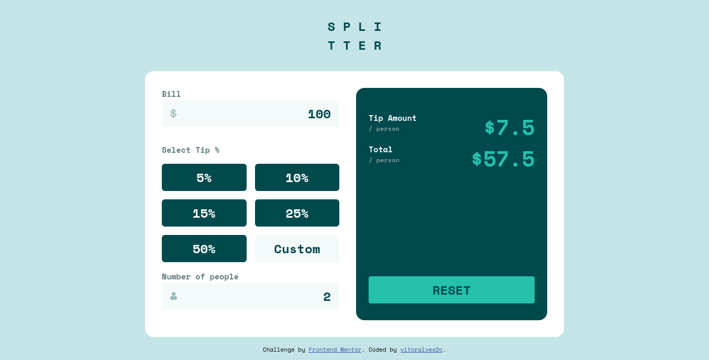

# Frontend Mentor - Tip Calculator App

This is a solution to the [Tip Calculator App challenge on Frontend Mentor](https://www.frontendmentor.io/challenges/tip-calculator-app-ugJNGbJUX).

## Table of contents

- [Overview](#overview)
  - [The challenge](#the-challenge)
  - [Screenshot](#screenshot)
  - [Links](#links)
- [My process](#my-process)
  - [Built with](#built-with)
  - [Useful resources](#useful-resources)
- [Author](#author)

## Overview

### The challenge

Users should be able to:

- View the optimal layout for the app depending on their device's screen size
- See hover states for all interactive elements on the page
- Calculate the correct tip and total cost of the bill per person

### Screenshot

### Links

- Solution URL: [https://www.frontendmentor.io/solutions/tip-calculator-app-solution-HkOS2hBH9](https://www.frontendmentor.io/solutions/tip-calculator-app-solution-HkOS2hBH9)
- Live Site URL: [https://cavalcantevitor.github.io/tip-calculator-app/](https://vitoralves2c.github.io/tip-calculator-app/)

## My process

### Built with

- HTML5 markup
- CSS custom properties
- Flexbox
- CSS Grid
- Mobile-first workflow
- Vanilla JS

### Useful resources

- [Mozilla Developer Network, MDN](https://developer.mozilla.org/en-US/) - MDN is a very good website that provides documentation for HTML, CSS and Javascript. It's been very useful when it comes to examples of codes and explanation of concepts. This time it helped me to understand a bit of CSS Grid that I needed to create the layout for the buttons. It never lets me down.
- [Andy Bell's CSS Reset](https://piccalil.li/blog/a-modern-css-reset/) - This is a new one for me. I was watching Kevin Powell on YouTube and he recommended this CSS reset in one of his videos and I have been using it ever since. It does a very good job at resetting the browser default styles making it basically a blank canvas for you to work on your design. Recomend it a lot.

## Author

- Github - [vitoraves2c](https://github.com/vitoralves2c)
- Frontend Mentor - [@vitoralves2c](https://www.frontendmentor.io/profile/vitoralves2c)

